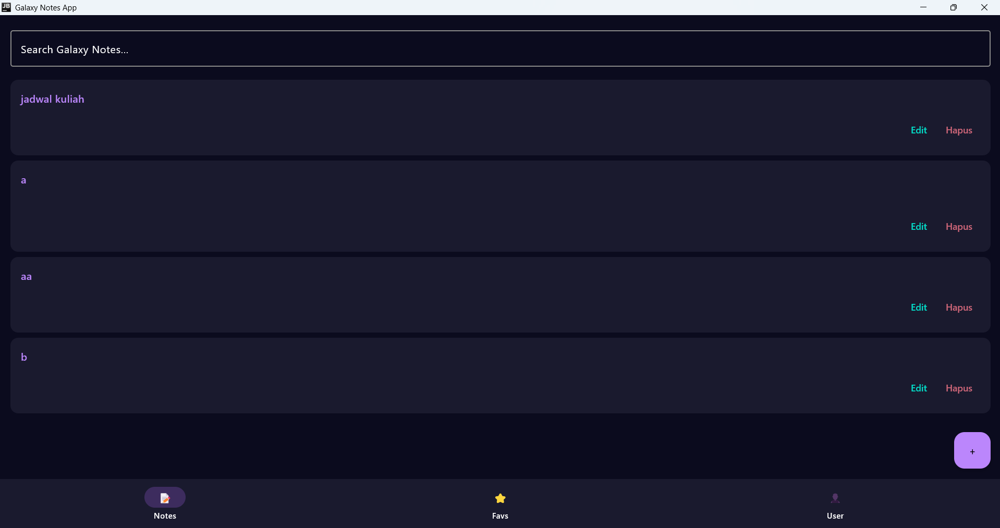
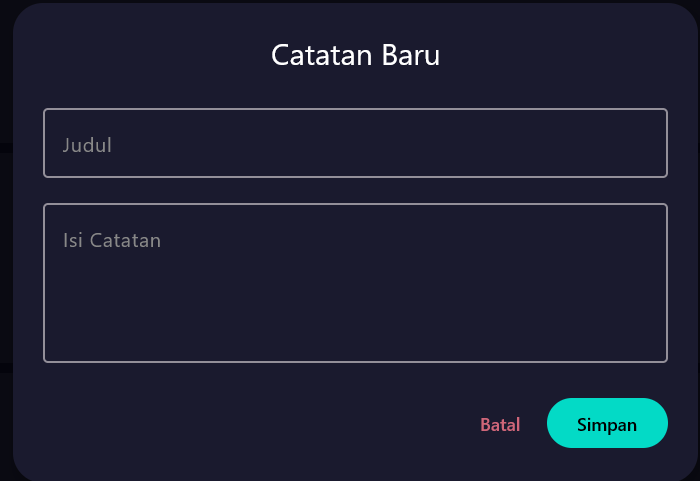
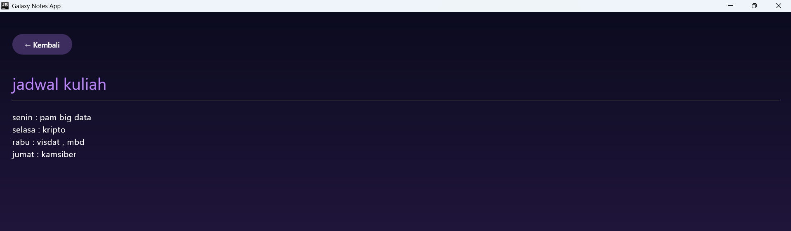
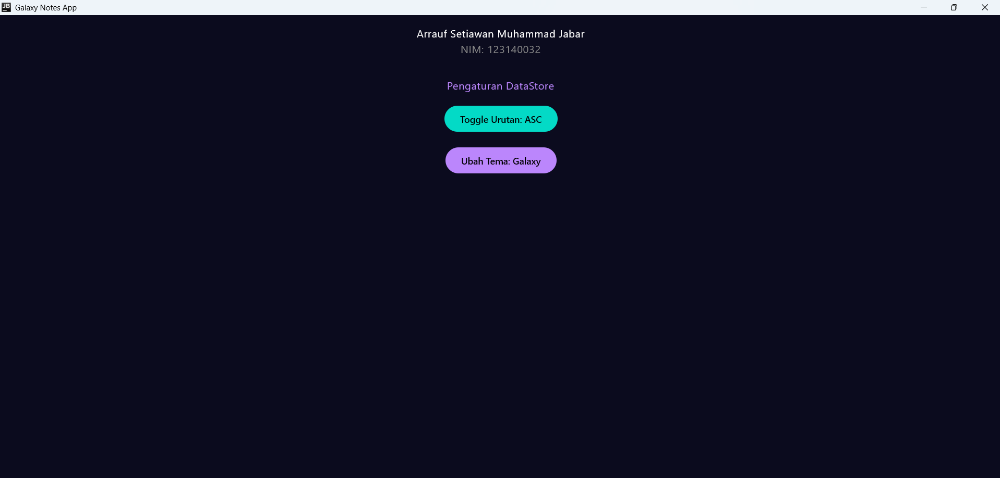
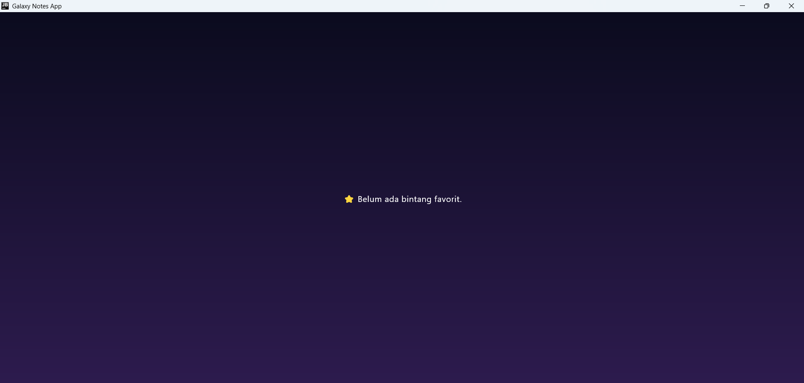

# Tugas Pengembangan Aplikasi Mobile 

## Identitas
- **Nama:** Arrauf Setiawan Muhammad Jabar
- **NIM:** 123140032


## ✨ Fitur Utama

| # | Fitur | Deskripsi |
|---|---|---|
| 1 | 🗄️ **Local Data Storage** | Penyimpanan data lokal terstruktur dengan SQLDelight dan pendekatan *offline-first* |
| 2 | ✏️ **CRUD Lengkap** | Buat, baca, perbarui, dan hapus catatan dengan mudah |
| 3 | 🔍 **Pencarian Real-time** | Cari catatan berdasarkan judul atau isi secara instan |
| 4 | ⚙️ **Preferensi Pengguna** | Pengaturan sort order (Terbaru/Terlama) dan tema (Galaxy Dark / Light) via DataStore |
| 5 | 🌌 **Proper UI States** | Tampilan *empty state* "Orbit kosong" saat belum ada data tersimpan |
 
---

## 📸 Dokumentasi Layar

### 1. 📋 Layar Daftar Catatan *(Note List & Search)*
> Menampilkan daftar catatan, kolom pencarian *real-time*, dan floating action button untuk menambah catatan baru.


```
[Screenshot — Note List & Search Screen]
```
 
---

### 2. ✏️ Layar Tambah / Edit Catatan
> Dialog form untuk memasukkan judul dan isi catatan baru, atau mengedit catatan yang sudah ada.



```
[Screenshot — Add / Edit Note Dialog]
```
 
---

### 3. 🔎 Layar Detail Catatan
> Menampilkan detail lengkap catatan yang dipilih, termasuk ID, judul, isi, dan tanggal pembuatan.


```
[Screenshot — Note Detail Screen]
```
 
---

### 4. ⚙️ Layar Pengaturan / Profil *(DataStore)*
> Tampilan identitas pengguna beserta tombol pengaturan DataStore untuk **Toggle Urutan** dan **Ubah Tema**.



```
[Screenshot — Settings / Profile Screen]
```
 
---

### 5. ⭐ Layar Favorit *(Empty State)*
> Tampilan layar saat daftar favorit masih kosong — menampilkan ilustrasi *empty state* "Orbit kosong".

```
[Screenshot — Favorites Empty State Screen]
```
 
---

## 🗄️ Skema Database

Aplikasi menggunakan **SQLite** melalui library SQLDelight dengan skema tabel `NoteEntity`:

```sql
CREATE TABLE NoteEntity (
    id        INTEGER PRIMARY KEY AUTOINCREMENT,
    title     TEXT    NOT NULL,
    content   TEXT    NOT NULL,
    createdAt INTEGER NOT NULL
);
```

> **📌 Catatan:** Kolom `createdAt` disimpan dalam format **epoch milliseconds** (`INTEGER`) untuk mempermudah proses sorting secara `ASC` maupun `DESC`.
 
---

## 🛠️ Teknologi yang Digunakan

| Teknologi | Kegunaan |
|---|---|
| [Kotlin Multiplatform](https://kotlinlang.org/docs/multiplatform.html) | Shared business logic lintas platform (Android & iOS) |
| [Compose Multiplatform](https://www.jetbrains.com/lp/compose-multiplatform/) | UI deklaratif lintas platform |
| [SQLDelight](https://cashapp.github.io/sqldelight/) | Database lokal & multiplatform SQLite drivers |
| [AndroidX DataStore](https://developer.android.com/topic/libraries/architecture/datastore) | Penyimpanan preferensi pengguna (sort order & tema) |
| [Kotlinx Datetime](https://github.com/Kotlin/kotlinx-datetime) | Manajemen waktu & konversi epoch timestamp |
| Navigation Compose | Navigasi antar layar dalam aplikasi |
 
---

## 🏗️ Arsitektur

Proyek ini menggunakan pola arsitektur **offline-first** dengan pemisahan layer yang jelas:

```
composeApp/
├── commonMain/
│   ├── data/
│   │   ├── local/          # SQLDelight database & DAOs
│   │   └── preferences/    # DataStore preferences
│   ├── domain/
│   │   ├── model/          # Data models (Note, SortOrder, Theme)
│   │   └── repository/     # Repository interfaces
│   └── presentation/
│       ├── notelist/       # Note List & Search screen
│       ├── notedetail/     # Note Detail screen
│       ├── addedit/        # Add / Edit Note dialog
│       ├── favorites/      # Favorites screen (empty state)
│       └── settings/       # Settings / Profile screen
├── androidMain/            # Android-specific implementations
└── iosMain/                # iOS-specific implementations
```
 
---


This is a Kotlin Multiplatform project targeting Android, iOS, Web, Desktop (JVM).

* [/composeApp](./composeApp/src) is for code that will be shared across your Compose Multiplatform applications.
  It contains several subfolders:
  - [commonMain](./composeApp/src/commonMain/kotlin) is for code that’s common for all targets.
  - Other folders are for Kotlin code that will be compiled for only the platform indicated in the folder name.
    For example, if you want to use Apple’s CoreCrypto for the iOS part of your Kotlin app,
    the [iosMain](./composeApp/src/iosMain/kotlin) folder would be the right place for such calls.
    Similarly, if you want to edit the Desktop (JVM) specific part, the [jvmMain](./composeApp/src/jvmMain/kotlin)
    folder is the appropriate location.

* [/iosApp](./iosApp/iosApp) contains iOS applications. Even if you’re sharing your UI with Compose Multiplatform,
  you need this entry point for your iOS app. This is also where you should add SwiftUI code for your project.

### Build and Run Android Application

To build and run the development version of the Android app, use the run configuration from the run widget
in your IDE’s toolbar or build it directly from the terminal:
- on macOS/Linux
  ```shell
  ./gradlew :composeApp:assembleDebug
  ```
- on Windows
  ```shell
  .\gradlew.bat :composeApp:assembleDebug
  ```

### Build and Run Desktop (JVM) Application

To build and run the development version of the desktop app, use the run configuration from the run widget
in your IDE’s toolbar or run it directly from the terminal:
- on macOS/Linux
  ```shell
  ./gradlew :composeApp:run
  ```
- on Windows
  ```shell
  .\gradlew.bat :composeApp:run
  ```

### Build and Run Web Application

To build and run the development version of the web app, use the run configuration from the run widget
in your IDE's toolbar or run it directly from the terminal:
- for the Wasm target (faster, modern browsers):
  - on macOS/Linux
    ```shell
    ./gradlew :composeApp:wasmJsBrowserDevelopmentRun
    ```
  - on Windows
    ```shell
    .\gradlew.bat :composeApp:wasmJsBrowserDevelopmentRun
    ```
- for the JS target (slower, supports older browsers):
  - on macOS/Linux
    ```shell
    ./gradlew :composeApp:jsBrowserDevelopmentRun
    ```
  - on Windows
    ```shell
    .\gradlew.bat :composeApp:jsBrowserDevelopmentRun
    ```

### Build and Run iOS Application

To build and run the development version of the iOS app, use the run configuration from the run widget
in your IDE’s toolbar or open the [/iosApp](./iosApp) directory in Xcode and run it from there.

---

Learn more about [Kotlin Multiplatform](https://www.jetbrains.com/help/kotlin-multiplatform-dev/get-started.html),
[Compose Multiplatform](https://github.com/JetBrains/compose-multiplatform/#compose-multiplatform),
[Kotlin/Wasm](https://kotl.in/wasm/)…

We would appreciate your feedback on Compose/Web and Kotlin/Wasm in the public Slack channel [#compose-web](https://slack-chats.kotlinlang.org/c/compose-web).
If you face any issues, please report them on [YouTrack](https://youtrack.jetbrains.com/newIssue?project=CMP).
